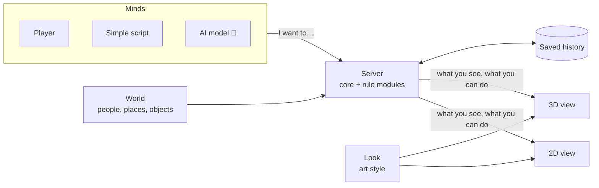

# MineWorld

English | [简体中文](README.zh-CN.md)

> **An open-source framework for building living game worlds that keep running and that you can
> walk around in.**


MineWorld is not one game. It is a set of building blocks for making your own. You pick the
pieces, put them together, adjust the settings and press run. You never copy a game and rewrite its
code.

- **Content** says who and what is in your world: people, places, objects.
- **Rule modules** say what can happen there: talking, making friends, buying, working, eating.
  Each one can be switched on or off by itself.
- **Minds** decide what each character does: a human player, a simple script, or an AI language
  model.
- **A look** says how it is drawn: the same world can be shown in 2D or in 3D.

In most games, the rules are written into the game's own code. To add shops, or to stop
two characters from talking, someone edits that code, and the change can break other parts. In
MineWorld each rule lives in its own module. Adding shops means switching on the money-and-shops
module; nothing else is edited. The café town in these pictures is the example world that comes with
MineWorld, ready to play. It is one thing you can build, not the product itself.

MineWorld is not a game engine. Drawing, animation and on-screen physics come from an existing
engine (the two views use [Godot](https://godotengine.org)). MineWorld provides what the engine
does not: a shared world with its people, its rules and its history, kept on a server.

```text
The world decides what happens.     the server holds every rule and every fact
Characters only ask to do things.   players, scripts or AI models send requests
The screen only shows the result.   2D, 3D, or any other way of drawing it
```

## Where it is going

The long-term goal ([`docs/VISION.md`](docs/VISION.md)):

- **A world that keeps living.** The server starts and nobody logs in, but the world goes on.
  People wake up, go to work, open their shops, meet each other, and keep their money, their
  belongings, their friendships and their memories. When you connect, you join a town that was
  already there. When you leave, it keeps going.
- **You are inside it, in 2D or 3D.** Walk down the street, go into the café, talk to the barista,
  buy a coffee. Play alone or with friends, with AI characters around you.
- **One big world made of many towns.** Towns are linked by trains, buses and taxis. A trip takes
  time in the world. On the train you can walk about and talk to the other passengers. There is a
  map of each town and of the whole world.
- **Close to the real world.** Sizes, speeds and other physical values come from real
  measurements, with the source written down (a person is about 50 cm across at the shoulders). The
  sun rises and sets for the town's real location, and the same wind moves the trees for every
  player. The long-term aim is a world that behaves roughly like the real one, as far as everyday
  physics goes.
- **Your rules, your style, your characters.** The world's author picks the art style, which rule
  modules are on, and a list of who may do what with whom: whether nobles and villagers may talk,
  whether a servant's words are remembered, whether a family heirloom may be sold. AI characters
  run on a model on your own computer by default, or on an online service with your own key. With no
  AI at all, the world still works.

## One world, two views


| 3D: walk the street in first or third person | 3D: talk to Alice at the counter |
| --- | --- |
|  |  |
| **2D: the same town, seen from above** | **2D: the menu next to Alice comes from the server** |
|  |  |

The 2D and 3D views are two ways of looking at the same world on the same server. When you click
on Alice in 2D, or walk up to her in 3D and press a key, the game sends the same request: "talk to
Alice". The server answers either with what happens, or with why not, for example "too far away"
or "not allowed here". Neither view makes up its own rules.

### One morning in the market town

1. At 05:30 Alice's shift starts, and she walks to the café counter. Her daily plan says so, and
   the simple script that drives her follows that plan.
2. You walk in and open the menu on yourself. "Buy coffee" is on it, because the money module
   offers it to anyone inside a shop.
3. You choose it. The server checks your wallet, takes the price, and gives you one coffee. It
   writes down what happened and why.
4. The café now has one coffee fewer. Every other player sees the lower stock, and the change is
   still there after the server restarts.
5. At 14:00 the shift ends. The jobs module reports that Alice's wages are due, and the money
   module pays her for the hours she was there. Then she walks to the park.

Today you buy in the 2D view; buying in 3D is being built. Switch the money module off and step 2
never appears: nobody can buy, and the rest of the town still works.

## What works today

✅ works and is tested · 🚧 being built now · 🗺 planned for the next stage

| Area | Status |
| --- | --- |
| **The core** | ✅ the world clock, activities that take time (such as a work shift), and a full record of every change and its cause. A world survives a crash and plays back exactly the same from the same starting point |
| **Building from blocks** | ✅ checked by tests: the market town is the café town plus six extra rule modules and some settings, with no change to the core. Remove any one of those modules and the town still runs |
| **Everyday life** | ✅ people walk, talk, meet, become friends, do things together, own and give things, work shifts, get paid, buy, eat and drink, for 300 days of game time |
| **Bodies** | ✅ people and objects never pass through each other; you can push, kick, throw and shove · 🚧 finding a way around walls and furniture, then walls in the towns |
| **Time and weather** | ✅ the date, the day of the week, sunrise and sunset; hour-by-hour weather on the server, based on San Diego's climate · 🚧 showing the weather in the 2D and 3D views, then weather from ten years of real records |
| **Your own rules** | ✅ the first adjustable rules (for example, how soon someone can speak again) · 🚧 rules for the other modules, and two example worlds: a manor with strict manners, and an ice rink |
| **Add-ons** | ✅ every module has a name, a version and a licence, and a world can say which versions it needs; new kinds of objects can be added without rebuilding · 🚧 a module from another repository |
| **Playing together** | ✅ invite codes, nicknames, a 30-second grace period to reconnect, a player taking over an AI character, a host who can pause or remove players · 🚧 a test with four players at once |
| **2D view** | ✅ (preview) walk, use doors, talk, invite, buy, give, eat and drink, all through menus the server provides |
| **3D view** | ✅ walk, run, jump, enter the café and talk to Alice on a running server · 🚧 the whole street built from the server's map, bumping into things, shopping, running smoothly on ordinary computers |
| **Settings** | 🚧 English and Simplified Chinese, resolution, window or full screen, frame-rate limit |
| **AI characters** | ✅ the Python toolkit they connect with · 🚧 a local model by default, online services with your own key, memory, and Alice remembering in 3D what you told her in 2D |
| **Computers** | ✅ the same world gives exactly the same results on macOS, Linux (Intel and ARM) and Windows, checked on every change to the main branch · 🚧 the full test suite on Windows |
| **Many towns** | 🗺 next stage: several towns in one world, trains, buses and taxis, walking about on board, town and world maps |
| **Looking real** | 🗺 next stage: hills from real height data, water you can wade in and that carries things along, trees that move in the server's wind |
| **Later** | 🗺 a visual world editor, modules shared by the community, public worlds that run all the time |

More detail: [`docs/MVP_STATUS.md`](docs/MVP_STATUS.md) and [`docs/MVP.md`](docs/MVP.md).

## How the building blocks fit

The **core knows almost nothing.** It knows that things exist, where they are, what time it is,
and what happened. It does not know what a job is, what money is, or that people sleep. Everything
that makes your world *your* world comes in a pack, a folder you add
([`docs/MODULE_SPEC.md`](docs/MODULE_SPEC.md)):

| Kind of pack | What it decides | Example here |
| --- | --- | --- |
| **Rule module** (System Pack) | what can happen | `systems/economy`: wallets, shops, buying, wages |
| **World** (World Pack) | one particular world: its people, places, and which rule modules are on | `worlds/market-town` |
| **Kinds of things** (Entity Pack) | what kinds of objects exist | ✅ shared between worlds, added without rebuilding; the example worlds still list their own |
| **Minds** (Controller Pack) | who decides what a character does | `cognition/rule-controller` · 🚧 AI models |
| **Look** (Presentation Pack) | how the world is drawn | `presentation/mineworld-default`, for 2D and 3D |
| **Art files** (Asset Pack) | the models, pictures and sounds | 🚧 today they live with the 2D and 3D programs |



Each rule module looks after its own part of the world and nothing else. If one module needs
another's data to change, it announces what happened and lets the owner decide. The jobs module
says "Alice's wages are due"; only the money module moves money. Remove a module and its actions
disappear, and nothing else breaks.

### The rule modules that exist

```text
presence        where people are, and what each of them can see
movement        walking, and which places connect
conversation    talking, and remembering who said what
group-activity  inviting people and doing things together
relationships   who knows whom, and how well
naming          what people are called
schedule        each person's daily plan
item            what kinds of objects exist
inventory       who is carrying what
item-transfer   giving things to each other
employment      jobs and shifts
economy         money, shops and wages
consumption     eating and drinking
bodies          bodies that cannot overlap; push, kick, throw, shove
calendar        the date and the sun
weather         the weather, hour by hour
fishing         🚧 the first module made outside this project, kept in its own repository
transport, maps, water   🗺 next stage
```

Example worlds: [`worlds/social-cafe`](worlds/social-cafe) (a café town),
[`worlds/market-town`](worlds/market-town) (the same town, with belongings, jobs, money and food),
and [`worlds/bodies-yard`](worlds/bodies-yard) (two rooms where people and boxes get in each
other's way).

### Switching a module on

A world lists the modules it uses in its `world.yaml`. The market town is the café town with six
lines added, plus the people's money, jobs and belongings:

```yaml
systems:
  - presence
  - movement
  - conversation
  # … the rest of the café town
  - item
  - inventory
  - item-transfer
  - economy
  - employment
  - consumption
```

To write a new rule module, add a folder under `systems/` and two lines under `systems/installed/`,
then rebuild. Nothing else changes: not the core, not the other modules, not the 2D or 3D views
([`systems/README.md`](systems/README.md), "Adding a pack").

## Try it

You need [Rust](https://rustup.rs) (the right version installs itself). For the 2D and 3D views
you also need [Godot 4.7](https://godotengine.org).

```sh
git clone https://github.com/yuema137/MineWorld && cd MineWorld

# No graphics: run the market town for 30 days of game time and watch people live
cargo run -p mineworld-cli -- run worlds/market-town --headless --seed 7 --days 30

# 2D: start the market town on your computer and play it (click to walk, click a person for a menu)
./mineworld-2d

# 3D: walk around the town (V switches camera, Shift runs, Space jumps)
./mineworld-slice

# 3D, connected to a running world: go into the café, walk to the counter, press E to talk to Alice
./mineworld-slice --world
```

Make your own world:

```sh
cargo run -p mineworld-cli -- create my-world      # a small starting world
cargo run -p mineworld-cli -- validate my-world    # what it contains, and anything wrong with it
cargo run -p mineworld-cli -- run my-world --headless --seed 1 --days 7
```

Then add people, places and objects as small text files, and switch modules on in `world.yaml`.
The file formats are in [`docs/MODULE_SPEC.md`](docs/MODULE_SPEC.md) and
[`docs/PACKAGE_FORMAT.md`](docs/PACKAGE_FORMAT.md).

**Which computers.** MineWorld is meant for macOS, Linux and Windows. Today it is developed and
played on macOS. A world gives exactly the same results on all three systems, and that is
checked automatically. Getting the full test suite to run on
Windows is being worked on now. To host the café town in Docker:
`docker build --target runtime -t mineworld .`, then
`docker run -p 7878:7878 -v mineworld:/var/lib/mineworld mineworld`.

## Read more

- [`docs/VISION.md`](docs/VISION.md): why this exists and where it is going
- [`docs/ARCHITECTURE.md`](docs/ARCHITECTURE.md): how the parts fit together
- [`docs/CORE_CONCEPTS.md`](docs/CORE_CONCEPTS.md): the words this project uses, defined
- [`docs/MODULE_SPEC.md`](docs/MODULE_SPEC.md) and [`docs/PACKAGE_FORMAT.md`](docs/PACKAGE_FORMAT.md): how to write packs
- [`CLAUDE.md`](CLAUDE.md) and [`docs/ENGINEERING_RULES.md`](docs/ENGINEERING_RULES.md): the rules
  every contribution follows. Every pull request runs the automatic checks;
  `python3 scripts/ci_layer.py fast` runs the quick ones on your computer

## License

MIT, except the Blender scripts in `clients/3d-spike/tools/blender/`, which are GPL-2.0-or-later
because they use Blender's GPL interface. Art from other people is CC0 (free for any use).
Where every piece of art came from, including the parts made with AI tools, is listed in
[`NOTICE`](NOTICE). The screenshots in `docs/images/readme/` were taken in this project's own 2D and
3D views.
