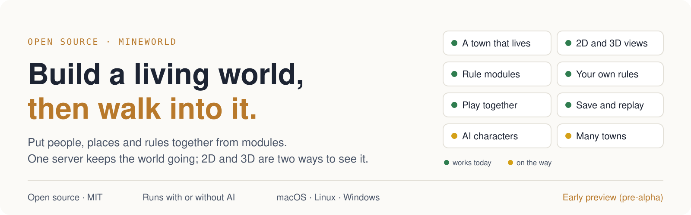
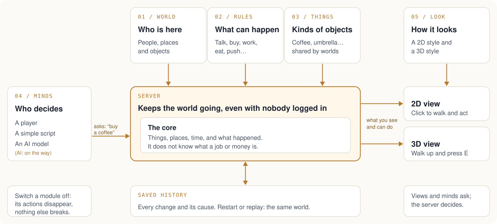
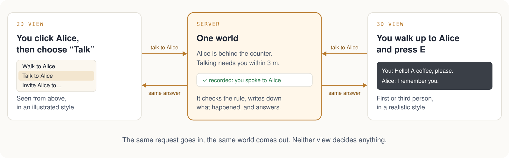
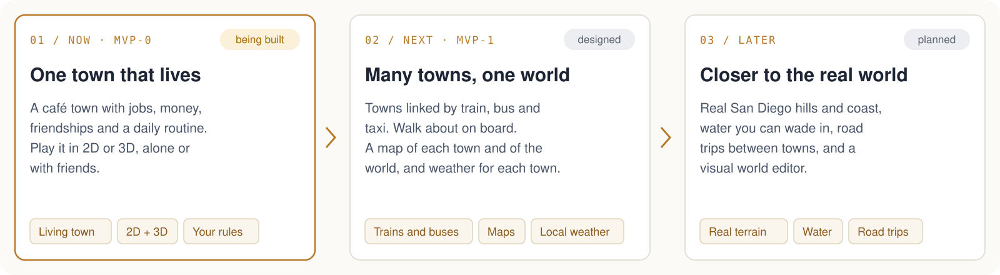

<p align="center">
  <picture>
    <source media="(prefers-color-scheme: dark)" srcset="docs/images/readme/hero-en-dark.svg">
    
  </picture>
</p>

<p align="center">
  
</p>

<p align="center">
  <a href="LICENSE"></a>
  <a href="https://github.com/yuema137/MineWorld/actions/workflows/ci.yml"></a>
  
  
  
  
</p>

<p align="center">
  <b>English</b> · <a href="README.zh-CN.md">简体中文</a>
</p>

<p align="center">
  <a href="#overview">Overview</a> ·
  <a href="#how-a-world-is-built">How it works</a> ·
  <a href="#one-world-two-views">Two views</a> ·
  <a href="#product-tour">Tour</a> ·
  <a href="#what-works-today">Status</a> ·
  <a href="#quick-start">Quick start</a> ·
  <a href="#where-it-is-going">Roadmap</a> ·
  <a href="#read-more">Docs</a>
</p>

## Overview

MineWorld is not one game. It is a set of building blocks for making your own game worlds: towns
with people who work, shop, make friends and keep living when nobody is logged in. You walk around
inside them, in 2D or in 3D.

In most games the rules are written into the game's own code. To add shops, or to stop two
characters from talking, someone edits that code, and the change can break other parts. In
MineWorld each rule lives in its own module. Adding shops means switching on the money-and-shops
module; nothing else is edited.

MineWorld is not a game engine. Drawing, animation and on-screen physics come from an existing
engine (the two views use [Godot](https://godotengine.org)). MineWorld provides what the engine does
not: a shared world with its people, its rules and its history, kept on a server.

The café town in these pictures is the example world that comes with MineWorld, ready to play. It
is one thing you can build, not the product itself.

## How a world is built

<picture>
  <source media="(prefers-color-scheme: dark)" srcset="docs/images/readme/how-it-works-en-dark.svg">
  
</picture>

You build a world from five kinds of packs. A pack is a folder you add
([`docs/MODULE_SPEC.md`](docs/MODULE_SPEC.md)):

1. **World**: who is in it. People, places and objects, written as short text files.
2. **Rule modules**: what can happen. Each one looks after its own part of the world: money,
   jobs, friendships. If the jobs module needs Alice to be paid, it says "Alice's wages are due",
   and only the money module moves money.
3. **Kinds of things**: coffee, umbrellas, books. Several worlds can share them.
4. **Minds**: who decides what a character does. A player, a simple script, or an AI model.
5. **Look**: how the world is drawn. A 2D style and a 3D style.

The core in the middle knows almost nothing: what exists, where, what time it is, and what
happened. It does not know what a job or money is. Switch a rule module off and its actions
disappear, while everything else keeps working.

<details>
<summary><b>The rule modules that exist today</b></summary>

```text
presence        where people are, and what each of them can see
movement        walking, and which places connect
conversation    talking, and remembering who said what
group-activity  inviting people and doing things together
relationships   who knows whom, and how well
naming          what people are called
schedule        each person's daily plan
item            what kinds of objects exist
inventory       who is carrying what
item-transfer   giving things to each other
employment      jobs and shifts
economy         money, shops and wages
consumption     eating and drinking
bodies          bodies that cannot overlap; push, kick, throw, shove; walking around furniture
calendar        the date and the sun
weather         the weather, hour by hour
fishing         the first module made outside this project, kept in its own repository
```

Example worlds: [`worlds/social-cafe`](worlds/social-cafe) (a café town),
[`worlds/market-town`](worlds/market-town) (the same town with belongings, jobs, money and food),
[`worlds/bodies-yard`](worlds/bodies-yard) (two rooms where people and boxes get in each other's
way).

A world lists the modules it uses in its `world.yaml`. The market town is the café town with six
lines added:

```yaml
systems:
  - presence
  - movement
  - conversation
  # … the rest of the café town
  - item
  - inventory
  - item-transfer
  - economy
  - employment
  - consumption
```

To write a new rule module, add a folder under `systems/` and two lines under `systems/installed/`,
then rebuild ([`systems/README.md`](systems/README.md), "Adding a pack").

</details>

## One world, two views

<picture>
  <source media="(prefers-color-scheme: dark)" srcset="docs/images/readme/two-views-en-dark.svg">
  
</picture>


The 2D and 3D views are two ways of looking at the same world on the same server. The server
answers every request with what happens, or with why not, for example "too far away" or "not
allowed here". Neither view makes up its own rules.

**One morning in the market town:**

1. At 05:30 Alice's shift starts, and she walks to the café counter. Her daily plan says so, and
   the simple script that drives her follows that plan.
2. You walk in and open the menu on yourself. "Buy coffee" is on it, because the money module
   offers it to anyone inside a shop.
3. You choose it. The server checks your wallet, takes the price, and gives you one coffee. It
   writes down what happened and why.
4. The café now has one coffee fewer. Every other player sees the lower stock, and the change is
   still there after the server restarts.
5. At 14:00 the shift ends. The jobs module reports that Alice's wages are due, and the money
   module pays her for the hours she was there. Then she walks to the park.

Today you buy in the 2D view; buying in 3D is being built. Switch the money module off and step 2
never appears: nobody can buy, and the rest of the town still works.

## Product tour

All pictures are taken in this project's own 2D and 3D views.

| | |
| --- | --- |
|  |  |
| **The main street, 3D.** Walk in first or third person. | **Talking to Alice, 3D.** Connected to a running server; she remembers what you said. |
|  |  |
| **Inside the café, 3D.** Walk in through the front door and look around. | **Your character, 3D.** The default player character in the café. |
|  |  |
| **The same town, 2D.** Seen from above, with the people who live there. | **A menu from the server, 2D.** What you can do with Alice right now. |
|  |  |
| **Shopping, 2D.** Your money, what you carry, and what is for sale here. | **One café, two views.** The same world, drawn twice. |

## What works today

✅ works and is tested · 🚧 being built now · 🗺 planned for the next stage

| Area | Status |
| --- | --- |
| **The core** | ✅ the world clock, activities that take time (such as a work shift), and a full record of every change and its cause. A world survives a crash and plays back exactly the same from the same starting point |
| **Building from blocks** | ✅ checked by tests: the market town is the café town plus six extra rule modules and some settings, with no change to the core. Remove any one of those modules and the town still runs |
| **Everyday life** | ✅ people walk, talk, meet, become friends, do things together, own and give things, work shifts, get paid, buy, eat and drink, for 300 days of game time |
| **Bodies** | ✅ people and objects never pass through each other; push, kick, throw and shove; the server plans a walk around walls and furniture · 🚧 townspeople using those planned walks, then walls in the towns |
| **Time and weather** | ✅ the date, the day of the week, sunrise and sunset; hour-by-hour weather on the server, based on San Diego's climate · 🚧 showing the weather in the 2D and 3D views, then weather from ten years of real records |
| **Your own rules** | ✅ the first adjustable rules (for example, how soon someone can speak again) · 🚧 rules for the other modules, and two example worlds: a manor with strict manners, and an ice rink |
| **Add-ons** | ✅ every module has a name, a version and a licence; a world says which versions it needs; new kinds of objects without rebuilding; a module from another repository, pinned to an exact version |
| **Playing together** | ✅ invite codes, nicknames, a 30-second grace period to reconnect, a player taking over an AI character, a host who can pause or remove players; each person is told only what they could see or hear · 🚧 a test with four players at once |
| **2D view** | ✅ (preview) walk, use doors, talk, invite, buy, give, eat and drink, all through menus the server provides |
| **3D view** | ✅ walk, run, jump, enter the café and talk to Alice on a running server · 🚧 the whole street built from the server's map, bumping into things, shopping, running smoothly on ordinary computers |
| **Settings** | ✅ press Esc in either view: English or Simplified Chinese, 12- or 24-hour clock, window and display options (in 3D also VSync and a frame-rate limit). Settings stay on your computer and are shared by both views |
| **AI characters** | ✅ the Python toolkit they connect with; one way to ask a model on your own computer or one of 11 online services with your own key · 🚧 the AI characters themselves, their memory, and Alice remembering in 3D what you told her in 2D |
| **Computers** | ✅ the same world gives exactly the same results on macOS, Linux (Intel and ARM) and Windows, checked on every change to the main branch · 🚧 the full test suite on Windows |
| **Many towns** | 🗺 next stage: several towns in one world, trains, buses and taxis, walking about on board, town and world maps |
| **Looking real** | 🗺 next stage: hills from real height data, water you can wade in and that carries things along, trees that move in the server's wind |

More detail: [`docs/MVP_STATUS.md`](docs/MVP_STATUS.md) and [`docs/MVP.md`](docs/MVP.md).

## Quick start

You need [Rust](https://rustup.rs) (the right version installs itself) and
[Godot 4.7](https://godotengine.org) on your `PATH`.

```sh
# 1. Get the code
git clone https://github.com/yuema137/MineWorld && cd MineWorld

# 2. Play the market town in 2D (click to walk, click a person for a menu, Q for your own menu,
#    Esc for settings, including 简体中文)
./mineworld-2d

# 3. Walk into the café in 3D and press E at the counter to talk to Alice
./mineworld-slice --world
```

Without any graphics, run the market town for 30 days of game time and read what happened:

```sh
cargo run -p mineworld-cli -- run worlds/market-town --headless --seed 7 --days 30
```

Make your own world, then add people, places and objects as text files and switch modules on in
its `world.yaml`:

```sh
cargo run -p mineworld-cli -- create my-world
cargo run -p mineworld-cli -- validate my-world
cargo run -p mineworld-cli -- run my-world --headless --seed 1 --days 7
```

**Which computers.** MineWorld is meant for macOS, Linux and Windows. Today it is developed and
played on macOS. A world gives exactly the same results on all three systems, and that is checked
automatically. Getting the full test suite to run on Windows is being worked on now. To host the
café town in Docker: `docker build --target runtime -t mineworld .`, then
`docker run -p 7878:7878 -v mineworld:/var/lib/mineworld mineworld`.

## Where it is going

<picture>
  <source media="(prefers-color-scheme: dark)" srcset="docs/images/readme/roadmap-en-dark.svg">
  
</picture>

- **A world that keeps living.** The server starts and nobody logs in, but the world goes on.
  When you connect, you join a town that was already there. When you leave, it keeps going.
- **One big world made of many towns.** A trip takes time in the world. On the train you can walk
  about and talk to the other passengers.
- **Close to the real world.** Sizes, speeds and other physical values come from real
  measurements, with the source written down (a person is about 50 cm across at the shoulders). The
  sun rises and sets for the town's real location, and the same wind moves the trees for every
  player.
- **Your rules, your style, your characters.** The world's author picks the art style, which rule
  modules are on, and a list of who may do what with whom: whether nobles and villagers may talk,
  whether a servant's words are remembered, whether a family heirloom may be sold. AI characters
  run on a model on your own computer by default, or on an online service with your own key. With no
  AI at all, the world still works.

The full picture is in [`docs/VISION.md`](docs/VISION.md).

## Read more

- [`docs/VISION.md`](docs/VISION.md): why this exists and where it is going
- [`docs/ARCHITECTURE.md`](docs/ARCHITECTURE.md): how the parts fit together
- [`docs/CORE_CONCEPTS.md`](docs/CORE_CONCEPTS.md): the words this project uses, defined
- [`docs/MODULE_SPEC.md`](docs/MODULE_SPEC.md) and [`docs/PACKAGE_FORMAT.md`](docs/PACKAGE_FORMAT.md): how to write packs
- [`CLAUDE.md`](CLAUDE.md) and [`docs/ENGINEERING_RULES.md`](docs/ENGINEERING_RULES.md): the rules
  every contribution follows. Every pull request runs the automatic checks;
  `python3 scripts/ci_layer.py fast` runs the quick ones on your computer

## License

MIT, except the Blender scripts in `clients/3d-spike/tools/blender/`, which are GPL-2.0-or-later
because they use Blender's GPL interface. Art from other people is CC0 (free for any use). Where
every piece of art came from, including the parts made with AI tools, is listed in
[`NOTICE`](NOTICE). The screenshots and diagrams in `docs/images/readme/` were made for this
project: the screenshots in its own 2D and 3D views, the diagrams by hand.
