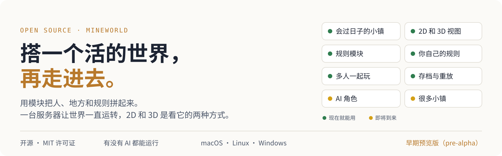
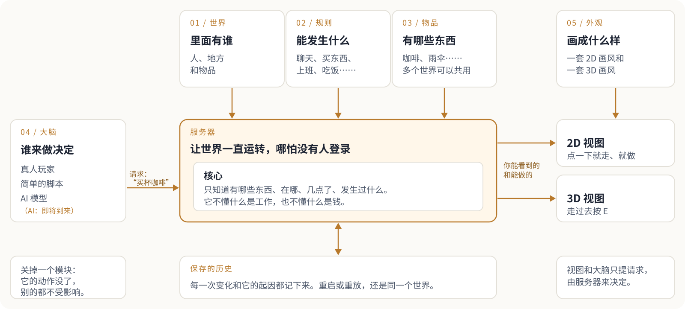
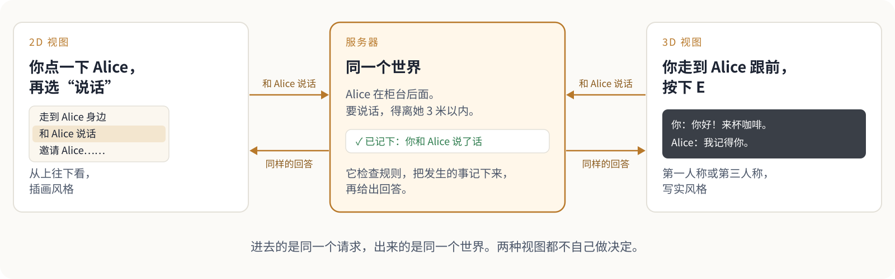
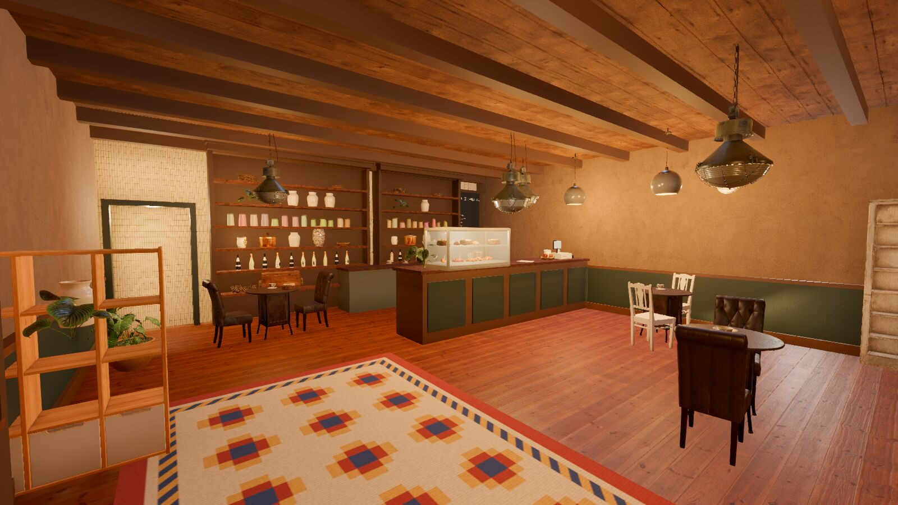
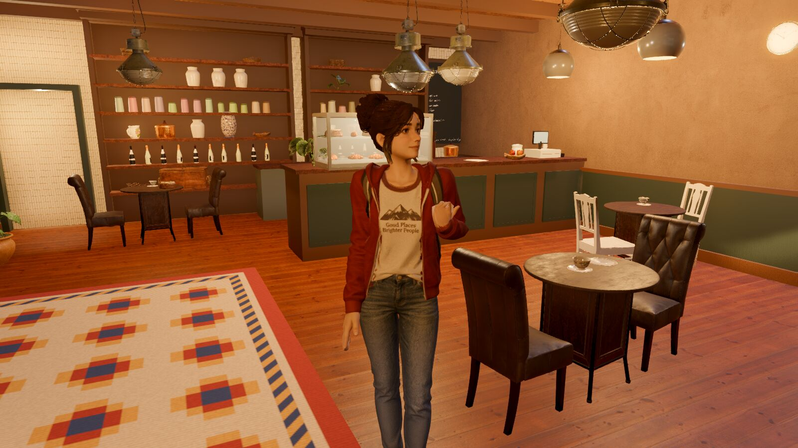
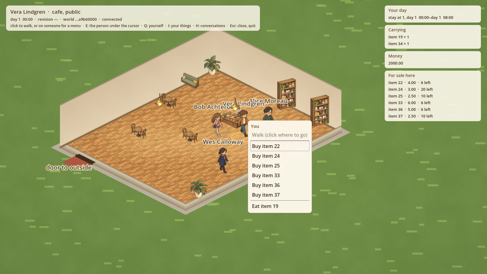
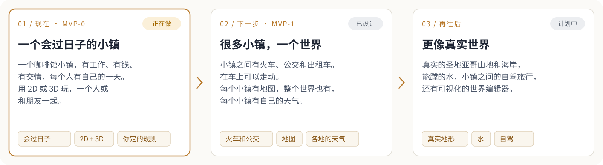

<p align="center">
  <picture>
    <source media="(prefers-color-scheme: dark)" srcset="docs/images/readme/hero-zh-dark.svg">
    
  </picture>
</p>

<p align="center">
  
</p>

<p align="center">
  <a href="LICENSE"></a>
  <a href="https://github.com/yuema137/MineWorld/actions/workflows/ci.yml"></a>
  
  
  
  
</p>

<p align="center">
  <a href="README.md">English</a> · <b>简体中文</b>
</p>

<p align="center">
  <a href="#概览">概览</a> ·
  <a href="#一个世界是怎么搭起来的">怎么搭</a> ·
  <a href="#一个世界两种看法">两种视图</a> ·
  <a href="#看看实际画面">实际画面</a> ·
  <a href="#现在能用什么">现状</a> ·
  <a href="#快速上手">快速上手</a> ·
  <a href="#接下来往哪走">路线图</a> ·
  <a href="#延伸阅读">文档</a>
</p>

> 本文是英文 [`README.md`](README.md) 的中文翻译。两者如有出入，以英文版为准。

## 概览

MineWorld 不是某一款游戏，而是一套积木，用来搭你自己的游戏世界。世界里的小镇有人上班、买东西、交朋友，就算没人登录也照样过日子。你可以走进去逛，用 2D 或 3D 都行。

大多数游戏把规则直接写在游戏自己的代码里。想加商店，或者不让两个角色说话，就得有人去改这些代码，改了还可能把别的地方弄坏。MineWorld 把每条规则放进单独的模块。想加商店，打开管钱和商店的那个模块就行，别的什么都不用改。

MineWorld 不是游戏引擎。画面、动画和屏幕上的物理效果，交给现成的引擎来做（两种视图用的是 [Godot](https://godotengine.org)）。MineWorld 补上引擎不管的那部分：一个放在服务器上、大家共用的世界，包括里面的人、规则和历史。

图里的咖啡馆小镇是 MineWorld 自带的示例世界，下载就能玩。它只是能搭出来的东西之一，并不是产品本身。

## 一个世界是怎么搭起来的

<picture>
  <source media="(prefers-color-scheme: dark)" srcset="docs/images/readme/how-it-works-zh-dark.svg">
  
</picture>

一个世界由五种"包"拼成。包就是你往项目里加的一个文件夹（[`docs/MODULE_SPEC.md`](docs/MODULE_SPEC.md)）：

1. **世界**：里面有谁。人、地方和物品，用简短的文本文件写出来。
2. **规则模块**：能发生什么。每个模块只管世界里自己那一摊，比如钱、工作、交情。工作模块要给 Alice 发工资时，只会说一句"Alice 的工资该发了"，真正动钱的只有钱的模块。
3. **物品种类**：咖啡、雨伞、书。多个世界可以共用。
4. **大脑**：角色由谁来做决定。可以是真人玩家，可以是简单的脚本，也可以是 AI 模型。
5. **外观**：世界画成什么样。一套 2D 画风，一套 3D 画风。

中间的核心几乎什么都不懂。它只知道有哪些东西、在哪、几点了、发生过什么，不懂什么是工作，也不懂什么是钱。关掉一个规则模块，它提供的动作就没了，别的都照常运转。

<details>
<summary><b>现有的规则模块</b></summary>

```text
presence        人在哪里，每个人能看到什么
movement        走路，以及哪些地方是连通的
conversation    聊天，并记住谁说过什么
group-activity  邀请别人、一起做事
relationships   谁认识谁，关系有多近
naming          每个人叫什么
schedule        每个人一天的安排
item            有哪些种类的东西
inventory       谁身上带着什么
item-transfer   互相送东西
employment      工作和班次
economy         钱、商店和工资
consumption     吃和喝
bodies          身体不会重叠；推、踢、扔、撞开；绕开家具走路
calendar        日期和太阳
weather         逐小时的天气
fishing         第一个由本项目以外的人写的模块，放在它自己的代码仓库里
```

示例世界：[`worlds/social-cafe`](worlds/social-cafe)（咖啡馆小镇）、[`worlds/market-town`](worlds/market-town)（同一个小镇，加上个人物品、工作、钱和食物）、[`worlds/bodies-yard`](worlds/bodies-yard)（两个房间，人和箱子互相挡路）。

一个世界在它的 `world.yaml` 里列出要用的模块。集市小镇就是咖啡馆小镇多加了六行：

```yaml
systems:
  - presence
  - movement
  - conversation
  # … 咖啡馆小镇的其余模块
  - item
  - inventory
  - item-transfer
  - economy
  - employment
  - consumption
```

要写一个新的规则模块，就在 `systems/` 下加一个文件夹，在 `systems/installed/` 里加两行，然后重新编译（[`systems/README.md`](systems/README.md) 的 "Adding a pack" 一节）。

</details>

## 一个世界两种看法

<picture>
  <source media="(prefers-color-scheme: dark)" srcset="docs/images/readme/two-views-zh-dark.svg">
  
</picture>


2D 和 3D 只是看同一个世界的两种方式，背后是同一台服务器。服务器对每个请求要么告诉你发生了什么，要么告诉你为什么不行，比如"离得太远"或"这里不允许"。两种视图都不会自己另定规则。

**集市小镇的一个早晨：**

1. 早上 5:30，Alice 开始上班，走到咖啡馆的柜台后面。这是她的每日安排里写好的，驱动她的那段简单脚本照着安排走。
2. 你走进店里，打开自己的菜单，上面有"买咖啡"。之所以有这一项，是因为钱的模块会给每个在店里的人提供购买选项。
3. 你选了它。服务器查一下你的钱包，扣掉价钱，给你一杯咖啡，并把发生了什么、为什么发生记下来。
4. 咖啡馆的咖啡少了一杯。其他玩家都能看到库存变少了，服务器重启以后也还是这样。
5. 下午 2:00 下班。工作模块报告"Alice 的工资该发了"，钱的模块按她在店里待的钟点付钱。然后她去公园散步。

目前买东西要在 2D 视图里做，3D 里的购物还在开发中。把钱的模块关掉，第 2 步就不会出现：谁也买不了东西，但小镇的其他部分照常运转。

## 看看实际画面

所有截图都是在本项目自己的 2D 和 3D 视图里截的。

| | |
| --- | --- |
|  |  |
| **主街，3D。** 用第一人称或第三人称走。 | **和 Alice 聊天，3D。** 连着一台正在运行的服务器，她记得你说过的话。 |
|  |  |
| **咖啡馆里面，3D。** 从正门走进去，四处看看。 | **你的角色，3D。** 默认的玩家角色站在咖啡馆里。 |
|  |  |
| **同一个小镇，2D。** 从上往下看，还有住在这里的人。 | **服务器给的菜单，2D。** 此刻你能和 Alice 做什么。 |
|  |  |
| **买东西，2D。** 你的钱、身上带的东西，以及这里在卖什么。 | **一家咖啡馆，两种视图。** 同一个世界，画了两遍。 |

## 现在能用什么

✅ 已能用，有测试 · 🚧 正在做 · 🗺 下一阶段的计划

| 方面 | 状态 |
| --- | --- |
| **核心** | ✅ 世界时钟、需要持续一段时间的活动（比如一个班次），以及每一次变化和它的起因的完整记录。程序崩溃后世界不会丢，从同一个起点重放，结果分毫不差 |
| **用积木搭世界** | ✅ 有测试证明：集市小镇 = 咖啡馆小镇 + 六个规则模块 + 一些设置，核心一行没改。去掉其中任何一个模块，小镇照样能运转 |
| **日常生活** | ✅ 人们走路、聊天、认识、交朋友、一起做事、拥有和赠送东西、上班、领工资、买东西、吃喝，能连续过 300 个游戏日 |
| **身体** | ✅ 人和物体不会互相穿过去；可以推、踢、扔、撞开别人；服务器会规划一条绕开墙和家具的路线 · 🚧 让镇上的人用上这些路线，然后给小镇加上墙 |
| **时间和天气** | ✅ 日期、星期几、日出日落；服务器按圣地亚哥的气候逐小时生成天气 · 🚧 在 2D 和 3D 视图里把天气画出来，之后改用十年的真实天气记录 |
| **你自己的规则** | ✅ 第一批可调的规则（比如一个人隔多久才能再开口）· 🚧 其他模块的规则，以及两个示例世界：一座讲规矩的庄园，一座溜冰场 |
| **扩展包** | ✅ 每个模块都有名字、版本号和许可证；世界会写明需要哪些版本；不用重新编译就能添加新种类的物品；可以用来自其他代码仓库的模块，并锁定到确切的版本 |
| **多人一起玩** | ✅ 邀请码、昵称、断线 30 秒内可以回来、真人接管 AI 角色、房主可以暂停或请人离开；每个人只会被告知自己看得到、听得到的事 · 🚧 四个人同时在线的测试 |
| **2D 视图** | ✅（预览版）走路、进出门、聊天、邀请、购买、赠送、吃喝，全部通过服务器给出的菜单 |
| **3D 视图** | ✅ 走、跑、跳，走进咖啡馆，在运行中的服务器上和 Alice 聊天 · 🚧 整条街都按服务器的地图来搭、会撞到东西、购物、在普通电脑上也流畅 |
| **设置** | 🚧 英文和简体中文、分辨率、窗口或全屏、帧率上限 |
| **AI 角色** | ✅ 它们用来接入世界的 Python 工具包；用同一种方式调用你自己电脑上的模型，或者用你自己的密钥调用 11 家在线服务之一 · 🚧 AI 角色本身、它们的记忆，以及你在 2D 里告诉 Alice 的话，她在 3D 里还记得 |
| **电脑系统** | ✅ 同一个世界在 macOS、Linux（Intel 和 ARM）和 Windows 上跑出的结果完全一致，主分支每次改动都会自动检查 · 🚧 完整测试在 Windows 上运行 |
| **很多小镇** | 🗺 下一阶段：一个世界里有好几个小镇，火车、公交、出租车，在车上走动，小镇地图和世界地图 |
| **看起来像真的** | 🗺 下一阶段：用真实高度数据做的山，能蹚、能把东西冲走的水，随服务器的风摆动的树 |

更多细节：[`docs/MVP_STATUS.md`](docs/MVP_STATUS.md) 和 [`docs/MVP.md`](docs/MVP.md)。

## 快速上手

你需要装 [Rust](https://rustup.rs)（会自动装上合适的版本）和 [Godot 4.7](https://godotengine.org)，并且能在命令行里直接运行它们。

```sh
# 1. 拿到代码
git clone https://github.com/yuema137/MineWorld && cd MineWorld

# 2. 用 2D 玩集市小镇（点地面走路，点人弹出菜单，按 Q 打开自己的菜单）
./mineworld-2d

# 3. 用 3D 走进咖啡馆，在柜台前按 E 和 Alice 说话
./mineworld-slice --world
```

完全不要画面，让集市小镇跑 30 个游戏日，看看发生了什么：

```sh
cargo run -p mineworld-cli -- run worlds/market-town --headless --seed 7 --days 30
```

搭一个你自己的世界，然后用文本文件添加人、地方和物品，在它的 `world.yaml` 里打开需要的模块：

```sh
cargo run -p mineworld-cli -- create my-world
cargo run -p mineworld-cli -- validate my-world
cargo run -p mineworld-cli -- run my-world --headless --seed 1 --days 7
```

**支持哪些电脑。** MineWorld 的目标是 macOS、Linux 和 Windows 都能用。目前在 macOS 上开发和游玩。同一个世界在三个系统上跑出的结果完全一致，这一点有自动检查。让完整测试也能在 Windows 上跑，正在进行中。想用 Docker 开一个咖啡馆小镇：先运行 `docker build --target runtime -t mineworld .`，再运行 `docker run -p 7878:7878 -v mineworld:/var/lib/mineworld mineworld`。

## 接下来往哪走

<picture>
  <source media="(prefers-color-scheme: dark)" srcset="docs/images/readme/roadmap-zh-dark.svg">
  
</picture>

- **一个自己会过日子的世界。** 服务器开着，哪怕没人登录，世界也照常运转。你一连上，就走进一个本来就在过日子的小镇；你下线了，它接着过。
- **很多小镇连成一个大世界。** 路上要花世界里的时间。在火车上你可以走动，跟别的乘客聊天。
- **贴近真实世界。** 尺寸、速度这些物理数值都取自真实测量，并写明出处（比如一个人肩宽大约 50 厘米）。太阳按小镇的真实位置升起落下，同一阵风会让每个玩家看到的树叶一起摆动。
- **规则、画风、角色都由你定。** 世界的作者可以选画风、选开哪些规则模块，还可以列一张"谁能对谁做什么"的清单：贵族和村民能不能说话，仆人说的话会不会被记住，传家宝能不能卖。AI 角色默认用你自己电脑上的模型，也可以用你自己的密钥接在线服务。就算完全不用 AI，世界照样能运转。

完整的设想见 [`docs/VISION.md`](docs/VISION.md)。

## 延伸阅读

以下文档均为英文：

- [`docs/VISION.md`](docs/VISION.md)：为什么做这个项目，要往哪里走
- [`docs/ARCHITECTURE.md`](docs/ARCHITECTURE.md)：各部分怎么配合
- [`docs/CORE_CONCEPTS.md`](docs/CORE_CONCEPTS.md)：本项目用到的词语及其定义
- [`docs/MODULE_SPEC.md`](docs/MODULE_SPEC.md) 和 [`docs/PACKAGE_FORMAT.md`](docs/PACKAGE_FORMAT.md)：怎么写包
- [`CLAUDE.md`](CLAUDE.md) 和 [`docs/ENGINEERING_RULES.md`](docs/ENGINEERING_RULES.md)：每一份贡献都要遵守的规则。每个 pull request 都会跑自动检查；在自己电脑上运行 `python3 scripts/ci_layer.py fast` 可以跑其中较快的那部分

## 许可证

MIT。例外是 `clients/3d-spike/tools/blender/` 里的 Blender 脚本：它们用到了 Blender 的 GPL 接口，所以采用 GPL-2.0-or-later。来自他人的美术素材是 CC0（任何用途都可以免费使用）。每一份美术素材的来源，包括用 AI 工具做的部分，都列在 [`NOTICE`](NOTICE) 里。`docs/images/readme/` 里的截图和示意图都是为本项目制作的：截图来自本项目自己的 2D 和 3D 视图，示意图是手工画的。
