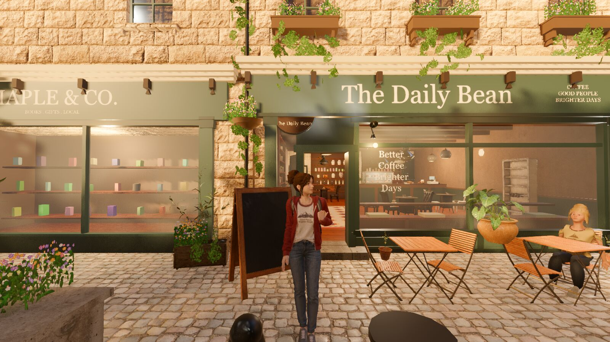
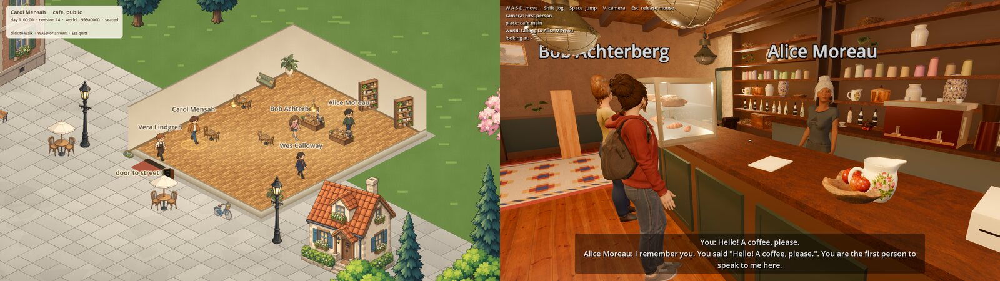
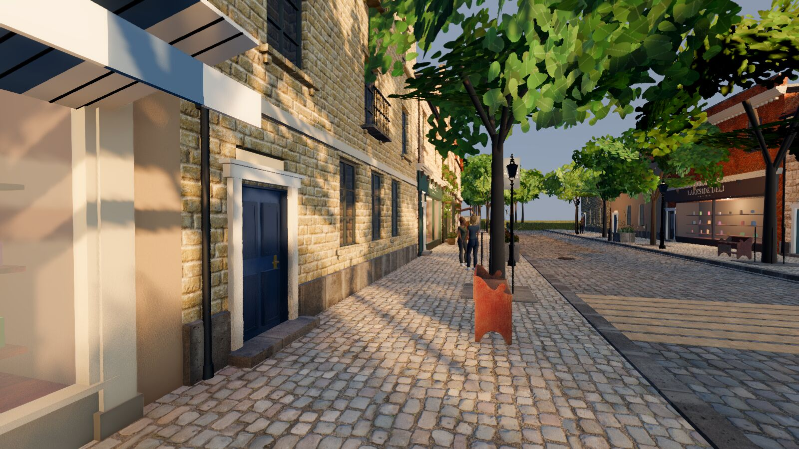
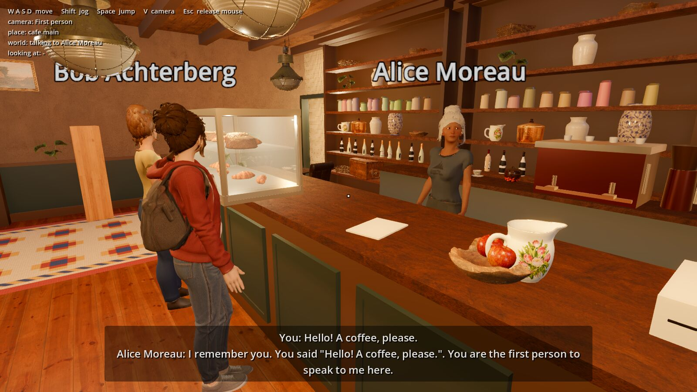
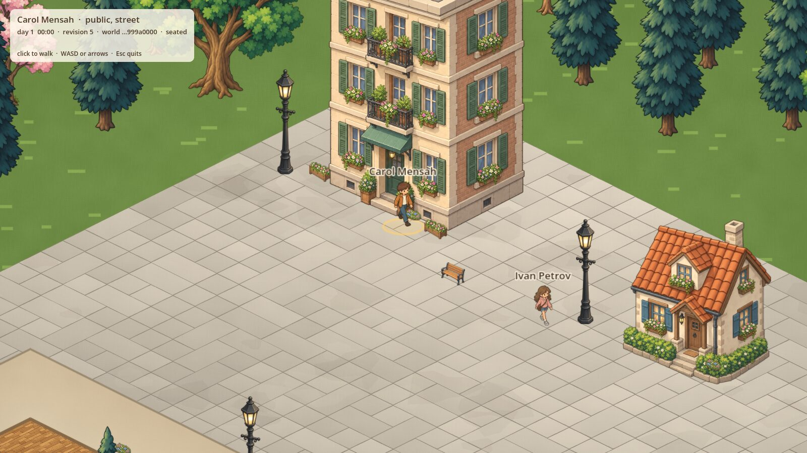
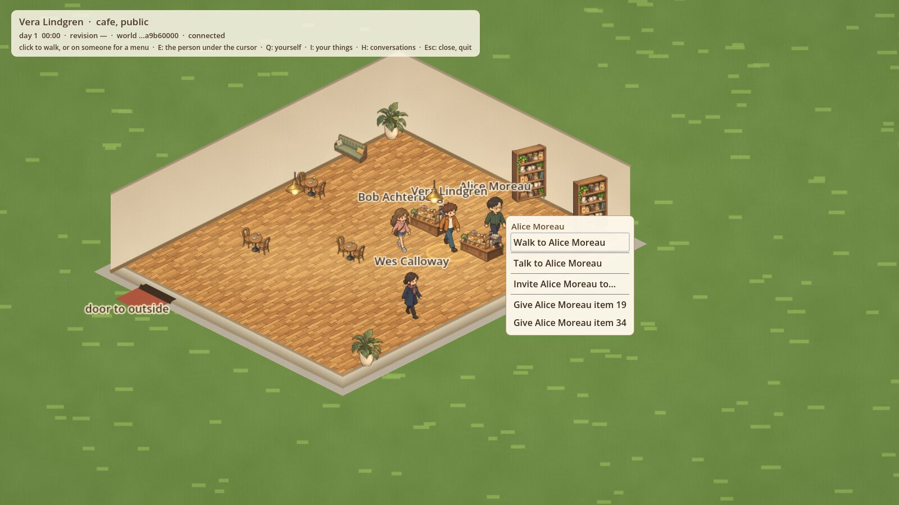
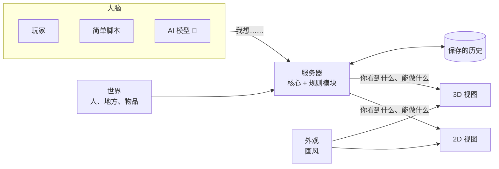

# MineWorld

[English](README.md) | 简体中文

> 本文是英文 [`README.md`](README.md) 的中文翻译。两者如有出入，以英文版为准。

> **一个开源框架，用来搭建一直在运转、你可以走进去逛的活的游戏世界。**



MineWorld 不是某一款游戏，而是一套积木，让你搭出自己的游戏。挑好零件，拼起来，调好设置，按下运行就行。你不需要把别人的游戏复制一份再去改它的代码。

- **内容**说的是你的世界里有谁、有什么，比如人、地方、物品。
- **规则模块**说的是世界里能发生什么，比如聊天、交朋友、买东西、上班、吃饭。每个模块都可以单独打开或关掉。
- **大脑**决定每个角色做什么。可以是真人玩家，可以是一段简单的脚本，也可以是一个 AI 语言模型。
- **外观**决定世界画成什么样。同一个世界既可以用 2D 显示，也可以用 3D 显示。

大多数游戏把规则直接写在游戏自己的代码里。想加商店，或者不让两个角色说话，就得有人去改这些代码，改了还可能把别的地方弄坏。MineWorld 把每条规则放进单独的模块。想加商店，打开管钱和商店的那个模块就行，别的什么都不用改。图里的咖啡馆小镇是 MineWorld 自带的示例世界，下载就能玩。它只是能搭出来的东西之一，并不是产品本身。

MineWorld 不是游戏引擎。画面、动画和屏幕上的物理效果，交给现成的引擎来做（两种视图用的是 [Godot](https://godotengine.org)）。MineWorld 补上引擎不管的那部分：一个放在服务器上、大家共用的世界，包括里面的人、规则和历史。

```text
世界决定发生什么。     所有规则和事实都在服务器上
角色只能提出请求。     玩家、脚本或 AI 模型发出请求
画面只负责显示结果。   2D、3D，或任何别的画法
```

## 最终要做成什么样

长远目标（[`docs/VISION.md`](docs/VISION.md)）：

- **一个自己会过日子的世界。** 服务器开着，哪怕没人登录，世界也照常运转。人们起床、上班、开店、碰面，各自的钱、东西、交情和记忆都留着。你一连上，就走进一个本来就在过日子的小镇；你下线了，它接着过。
- **你就在里面，2D 或 3D 都行。** 走在街上，推门进咖啡馆，跟店员聊几句，买杯咖啡。可以一个人玩，也可以和朋友一起，身边还有 AI 角色。
- **很多小镇连成一个大世界。** 小镇之间有火车、公交和出租车。路上要花世界里的时间；在火车上你可以走动，跟别的乘客聊天。每个小镇有自己的地图，整个世界也有一张总地图。
- **贴近真实世界。** 尺寸、速度这些物理数值都取自真实测量，并写明出处（比如一个人肩宽大约 50 厘米）。太阳按小镇的真实位置升起落下，同一阵风会让每个玩家看到的树叶一起摆动。长远来看，在日常物理的范围内，这个世界要大致像真实世界一样运转。
- **规则、画风、角色都由你定。** 世界的作者可以选画风、选开哪些规则模块，还可以列一张"谁能对谁做什么"的清单：贵族和村民能不能说话，仆人说的话会不会被记住，传家宝能不能卖。AI 角色默认用你自己电脑上的模型，也可以用你自己的密钥接在线服务。就算完全不用 AI，世界照样能运转。

## 一个世界，两种看法



| 3D：第一人称或第三人称逛街 | 3D：在柜台前和 Alice 聊天 |
| --- | --- |
|  |  |
| **2D：同一个小镇，从上往下看** | **2D：Alice 旁边的菜单由服务器给出** |
|  |  |

2D 和 3D 只是看同一个世界的两种方式，背后是同一台服务器。你在 2D 里点 Alice，或者在 3D 里走到她跟前按一个键，游戏发出的都是同一个请求："和 Alice 说话"。服务器要么告诉你发生了什么，要么告诉你为什么不行，比如"离得太远"或"这里不允许"。两种视图都不会自己另定规则。

### 集市小镇的一个早晨

1. 早上 5:30，Alice 开始上班，走到咖啡馆的柜台后面。这是她的每日安排里写好的，驱动她的那段简单脚本照着安排走。
2. 你走进店里，打开自己的菜单，上面有"买咖啡"。之所以有这一项，是因为钱的模块会给每个在店里的人提供购买选项。
3. 你选了它。服务器查一下你的钱包，扣掉价钱，给你一杯咖啡，并把发生了什么、为什么发生记下来。
4. 咖啡馆的咖啡少了一杯。其他玩家都能看到库存变少了，服务器重启以后也还是这样。
5. 下午 2:00 下班。工作模块报告"Alice 的工资该发了"，钱的模块按她在店里待的钟点付钱。然后她去公园散步。

目前买东西要在 2D 视图里做，3D 里的购物还在开发中。把钱的模块关掉，第 2 步就不会出现：谁也买不了东西，但小镇的其他部分照常运转。

## 现在能用什么

✅ 已能用，有测试 · 🚧 正在做 · 🗺 下一阶段的计划

| 方面 | 状态 |
| --- | --- |
| **核心** | ✅ 世界时钟、需要持续一段时间的活动（比如一个班次），以及每一次变化和它的起因的完整记录。程序崩溃后世界不会丢，从同一个起点重放，结果分毫不差 |
| **用积木搭世界** | ✅ 有测试证明：集市小镇 = 咖啡馆小镇 + 六个规则模块 + 一些设置，核心一行没改。去掉其中任何一个模块，小镇照样能运转 |
| **日常生活** | ✅ 人们走路、聊天、认识、交朋友、一起做事、拥有和赠送东西、上班、领工资、买东西、吃喝，能连续过 300 个游戏日 |
| **身体** | ✅ 人和物体不会互相穿过去；可以推、踢、扔、撞开别人 · 🚧 学会绕开墙和家具走路，然后给小镇加上墙 |
| **时间和天气** | ✅ 日期、星期几、日出日落 · 🚧 天气，之后改用十年的真实天气记录 |
| **你自己的规则** | ✅ 第一批可调的规则（比如一个人隔多久才能再开口）· 🚧 其他模块的规则，以及两个示例世界：一座讲规矩的庄园，一座溜冰场 |
| **扩展包** | ✅ 每个模块都有名字、版本号和许可证，世界可以写明需要哪些版本 · 🚧 来自其他代码仓库的模块，以及不用重新编译就能添加新种类的物品 |
| **多人一起玩** | ✅ 邀请码、昵称、断线 30 秒内可以回来、真人接管 AI 角色、房主可以暂停或请人离开 · 🚧 四个人同时在线的测试 |
| **2D 视图** | ✅（预览版）走路、进出门、聊天、邀请、购买、赠送、吃喝，全部通过服务器给出的菜单 |
| **3D 视图** | ✅ 走、跑、跳，走进咖啡馆，在运行中的服务器上和 Alice 聊天 · 🚧 整条街都按服务器的地图来搭、会撞到东西、购物、在普通电脑上也流畅 |
| **设置** | 🚧 英文和简体中文、分辨率、窗口或全屏、帧率上限 |
| **AI 角色** | ✅ 它们用来接入世界的 Python 工具包 · 🚧 默认用本地模型、也可以用你自己的密钥接在线服务、记忆，以及你在 2D 里告诉 Alice 的话，她在 3D 里还记得 |
| **电脑系统** | ✅ 自动测试在 Linux 上运行；Python 工具包在 macOS、Linux 和 Windows 上都有测试 · 🚧 三个系统上结果完全一致，以及完整测试在 Windows 上运行 |
| **很多小镇** | 🗺 下一阶段：一个世界里有好几个小镇，火车、公交、出租车，在车上走动，小镇地图和世界地图 |
| **看起来像真的** | 🗺 下一阶段：用真实高度数据做的山，能蹚、能把东西冲走的水，随服务器的风摆动的树 |
| **再往后** | 🗺 可视化的世界编辑器、大家共享的模块、一直开着的公共世界 |

更多细节：[`docs/MVP_STATUS.md`](docs/MVP_STATUS.md) 和 [`docs/MVP.md`](docs/MVP.md)。

## 积木是怎么拼起来的

**核心几乎什么都不懂。** 它只知道有哪些东西、它们在哪、现在几点、发生过什么。它不懂什么是工作，什么是钱，也不知道人要睡觉。让你的世界成为*你的*世界的一切，都装在"包"里。包就是你往项目里加的一个文件夹（[`docs/MODULE_SPEC.md`](docs/MODULE_SPEC.md)）：

| 包的种类 | 它决定什么 | 本仓库里的例子 |
| --- | --- | --- |
| **规则模块**（System Pack） | 能发生什么 | `systems/economy`：钱包、商店、购买、工资 |
| **世界**（World Pack） | 一个具体的世界：里面的人、地方，以及打开了哪些规则模块 | `worlds/market-town` |
| **物品种类**（Entity Pack） | 有哪些种类的东西 | 🚧 让多个世界共用；现在每个世界各列各的 |
| **大脑**（Controller Pack） | 角色由谁来做决定 | `cognition/rule-controller` · 🚧 AI 模型 |
| **外观**（Presentation Pack） | 世界画成什么样 | `presentation/mineworld-default`，2D 和 3D 都有 |
| **美术文件**（Asset Pack） | 模型、图片和声音 | 🚧 现在放在 2D 和 3D 程序里 |



每个规则模块只管自己那一摊，别的不碰。如果一个模块需要改动别人的数据，它就把发生的事说出来，由负责的模块自己决定。工作模块说"Alice 的工资该发了"，只有钱的模块才会真的去动钱。去掉一个模块，它提供的那些动作就没了，别的都不受影响。

### 现有的规则模块

```text
presence        人在哪里，每个人能看到什么
movement        走路，以及哪些地方是连通的
conversation    聊天，并记住谁说过什么
group-activity  邀请别人、一起做事
relationships   谁认识谁，关系有多近
naming          每个人叫什么
schedule        每个人一天的安排
item            有哪些种类的东西
inventory       谁身上带着什么
item-transfer   互相送东西
employment      工作和班次
economy         钱、商店和工资
consumption     吃和喝
bodies          身体不会重叠；推、踢、扔、撞开
calendar        日期和太阳
weather         🚧 天气
fishing         🚧 第一个由本项目以外的人写的模块，放在它自己的代码仓库里
transport、maps、water   🗺 下一阶段（交通、地图、水）
```

示例世界：[`worlds/social-cafe`](worlds/social-cafe)（咖啡馆小镇）、[`worlds/market-town`](worlds/market-town)（同一个小镇，加上个人物品、工作、钱和食物），以及 [`worlds/bodies-yard`](worlds/bodies-yard)（两个房间，人和箱子互相挡路）。

### 打开一个模块

一个世界在它的 `world.yaml` 里列出要用的模块。集市小镇就是咖啡馆小镇多加了六行，再给人们配上钱、工作和随身物品：

```yaml
systems:
  - presence
  - movement
  - conversation
  # … 咖啡馆小镇的其余模块
  - item
  - inventory
  - item-transfer
  - economy
  - employment
  - consumption
```

要写一个新的规则模块，就在 `systems/` 下加一个文件夹，在 `systems/installed/` 里加两行，然后重新编译。别的都不用动：核心不用改，其他模块不用改，2D 和 3D 视图也不用改（[`systems/README.md`](systems/README.md) 的 "Adding a pack" 一节）。

## 试一试

你需要装 [Rust](https://rustup.rs)（会自动装上合适的版本）。想看 2D 和 3D 视图，还需要 [Godot 4.7](https://godotengine.org)。

```sh
git clone https://github.com/yuema137/MineWorld && cd MineWorld

# 不要画面：让集市小镇跑 30 个游戏日，看人们过日子
cargo run -p mineworld-cli -- run worlds/market-town --headless --seed 7 --days 30

# 2D：在你的电脑上开一个集市小镇来玩（点地面走路，点人弹出菜单）
./mineworld-2d

# 3D：在小镇里逛（V 切换视角，Shift 跑，空格跳）
./mineworld-slice

# 3D，连上一个正在运行的世界：走进咖啡馆，走到柜台前，按 E 和 Alice 说话
./mineworld-slice --world
```

搭一个你自己的世界：

```sh
cargo run -p mineworld-cli -- create my-world      # 一个小小的起步世界
cargo run -p mineworld-cli -- validate my-world    # 看看里面有什么，有没有写错的地方
cargo run -p mineworld-cli -- run my-world --headless --seed 1 --days 7
```

接下来用简短的文本文件添加人、地方和物品，在 `world.yaml` 里打开需要的模块。文件格式见 [`docs/MODULE_SPEC.md`](docs/MODULE_SPEC.md) 和 [`docs/PACKAGE_FORMAT.md`](docs/PACKAGE_FORMAT.md)。

**支持哪些电脑。** MineWorld 的目标是 macOS、Linux 和 Windows 都能用。目前在 macOS 上开发和游玩，自动测试在 Linux 上跑。让完整测试也能在 Windows 上跑，正在进行中。想用 Docker 开一个咖啡馆小镇：先运行 `docker build --target runtime -t mineworld .`，再运行 `docker run -p 7878:7878 -v mineworld:/var/lib/mineworld mineworld`。

## 延伸阅读

以下文档均为英文：

- [`docs/VISION.md`](docs/VISION.md)：为什么做这个项目，要往哪里走
- [`docs/ARCHITECTURE.md`](docs/ARCHITECTURE.md)：各部分怎么配合
- [`docs/CORE_CONCEPTS.md`](docs/CORE_CONCEPTS.md)：本项目用到的词语及其定义
- [`docs/MODULE_SPEC.md`](docs/MODULE_SPEC.md) 和 [`docs/PACKAGE_FORMAT.md`](docs/PACKAGE_FORMAT.md)：怎么写包
- [`CLAUDE.md`](CLAUDE.md) 和 [`docs/ENGINEERING_RULES.md`](docs/ENGINEERING_RULES.md)：每一份贡献都要遵守的规则。每个 pull request 都会跑自动检查；在自己电脑上运行 `python3 scripts/ci_layer.py fast` 可以跑其中较快的那部分

## 许可证

MIT。例外是 `clients/3d-spike/tools/blender/` 里的 Blender 脚本：它们用到了 Blender 的 GPL 接口，所以采用 GPL-2.0-or-later。来自他人的美术素材是 CC0（任何用途都可以免费使用）。每一份美术素材的来源，包括用 AI 工具做的部分，都列在 [`NOTICE`](NOTICE) 里。`docs/images/readme/` 里的截图都是在本项目自己的 2D 和 3D 视图里截的。
